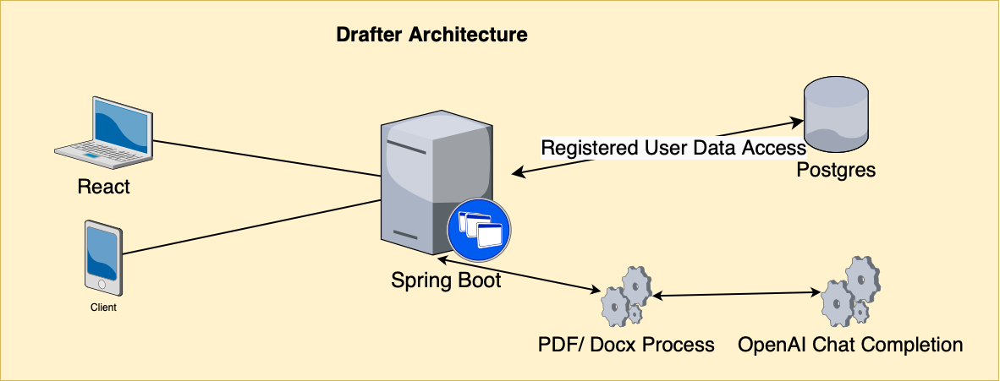

# What is Drafter?
## ------------ Design Document------------ 
## Introduction
Drafter is a LLM powered cover letter drafter to help applicant to draft.
Everyone wants to apply for a job quickly and good cover letter will help
but no one wants to write one, AI is here to help.

Drafter also allow applicant to register an account:
1. save the progress of the applications with different status.
2. save the drafted content.

#### Glossary
- Non-registered Applicant: users without account 
- Applicant: registered users 
- Status: application status - waiting, rejected, ghosted, interviewing, offered. 
- Companies: the target companies

## Goal 
Drafter's goal is to provide a quick solution to drafting cover letter and save application progress,
the less hooping between links and websites the better, ideally if we can save users' resume or fetch from their cloud storage
such as Google Drive, OneDrive then create a new cover letter for each application will be the best case scenario.

At the stage we need allow resume to be uploaded and cover letter content being presented correctly,
testing on the prompt message is needed.

### Application Users
#### Non-registered Applicants
User are allow to:
1. Create cover letter every 30 mins (need to find a way to track it), 
   - they resume will not be saved, each draft require upload and fill in the information.

####  Applicant
Applicant are able to:
1. Prompt and update cover letter content via a chat box.
2. CRUD job application progress
3. Filter records by status, company, job title, date
4. Access to dashboard to check all status
5. Reminded of a follow-up.
6. Save resume or connected to their cloud storage

## Non-Goal
At this stage we will not be scraping, having job search, posting,
this is a pilot project for fun at this stage.

## Design Detail
### Architecture

#### Frontend technology
- React
- React Router
- TailwindCSS
- Typescript
- React Hook Form

#### Backend technology
- Spring Boot
- Postgres
### Database Design
#### Conceptual Design
- User: id, username, password, email, resumes
- Resume: id, user
- Application: id, job_title, job_id, company, created_at, updated_at, status
- Status: id, status
- Company: id, company_name, company_description
- Industry: id, industry_name

#### Logical Design
- Applicant 
  - id primary key
  - username varchar(50) not null unique
  - password varchar(255) not null
  - email varchar(255) not null unique
- Resume
  - id primary key
  - user_id foreign key
- Application
  - id primary key
  - job_title varchar(255) not null
  - job_id varchar(50)
  - remark text
  - company_id foreign key
  - status_id foregin key
  - created_at timestamp
  - updated_at timestamp
- Status
  - id primary key
  - status varchar(50)
- Company
  - id primary key
  - company_name varchar(255)
  - company_description varchar(255)
- Industry 
   - id primary key
   - industry_name varchar(255)

#### Physical Design

## Summary

